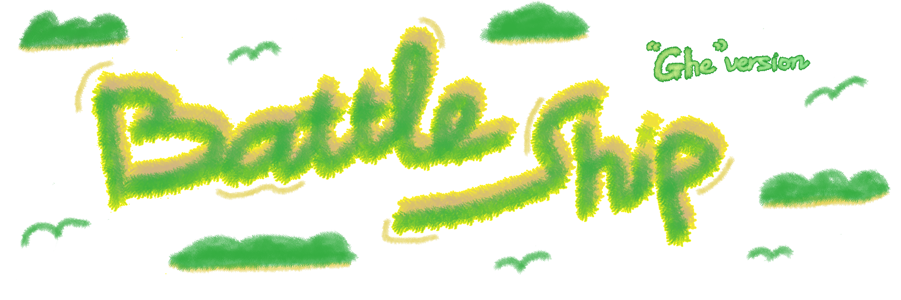

  

    
    

    
    
    
     

 
    
<h2>🏄🏻‍♂️ About this project: </h2>

The goal of this project is to design a game that applies the usage of data structure and algorithms and principles of object-oriented programming. We decided to design a game based on the classic strategic board game <a href="https://en.wikipedia.org/wiki/Battleship_%28game%29" target="_blank">Battleship game</a>. Our project aims to modify this multiplayer game to single player game by implementing a bot to play with the user.

---
## Background materials
- [UML diagrams](https://www.lucidchart.com/blog/types-of-UML-diagrams)
- <i class="far fa-exclamation"></i> [S - Single Responsibility Principle](https://www.baeldung.com/java-single-responsibility-principle)
- <i class="far fa-exclamation"></i> [O - Open/Closed Principle](https://www.baeldung.com/java-open-closed-principle)
- <i class="far fa-exclamation"></i> [Inheritance in Java](https://www.w3schools.com/java/java_inheritance.asp)
- <i class="far fa-exclamation"></i> [Abstraction in Java](https://www.w3schools.com/java/java_abstract.asp)
- <i class="far fa-exclamation"></i> [Polymorphism in Java](https://www.w3schools.com/java/java_polymorphism.asp)
- <i class="far fa-exclamation"></i> [Getters and Setters in Java](https://www.w3schools.com/java/java_encapsulation.asp)
- [Tips on Battleship strategy](https://www.wikihow.com/Win-at-Battleship)